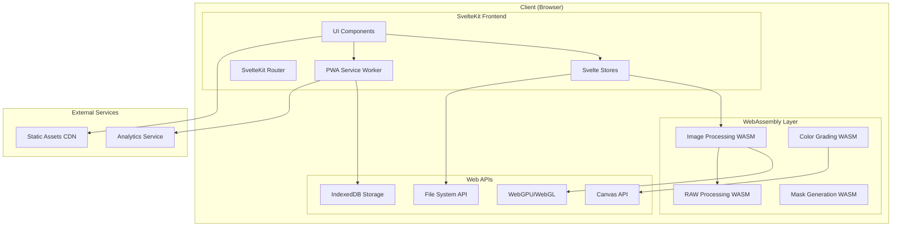

# Design Document

## Overview

This design document outlines the architecture and implementation approach for transforming RapidRAW from a Tauri desktop application into a mobile-friendly Progressive Web App (PWA) using SvelteKit. The transformation involves migrating the React frontend to SvelteKit, converting Rust backend functionality to WebAssembly, implementing responsive mobile interfaces with glassmorphism design, and adding enhanced color grading features.

The design prioritizes performance on mobile devices, offline capability, and maintaining the sophisticated image processing capabilities of the original application while adapting to web platform constraints.

## Architecture

### High-Level Architecture



### Component Architecture

The application will follow a modular component architecture with clear separation of concerns:

- **Presentation Layer**: SvelteKit components with glassmorphism styling
- **State Management**: Svelte stores for reactive state management
- **Processing Layer**: WebAssembly modules for image processing
- **Storage Layer**: IndexedDB for offline data persistence
- **Service Layer**: PWA service worker for caching and offline functionality

## Components and Interfaces

### Core SvelteKit Components

#### 1. Layout Components
- `App.svelte` - Root application component
- `Layout.svelte` - Main layout with responsive navigation
- `MobileNavigation.svelte` - Touch-optimized navigation drawer
- `TabletLayout.svelte` - Tablet-specific layout optimization

#### 2. Image Processing Components
- `ImageEditor.svelte` - Main image editing interface
- `ImageCanvas.svelte` - Canvas-based image display with touch gestures
- `TouchControls.svelte` - Mobile-optimized adjustment controls
- `GestureHandler.svelte` - Touch gesture processing component

#### 3. Adjustment Panels
- `BasicAdjustments.svelte` - Exposure, contrast, highlights, shadows
- `ColorGrading.svelte` - Enhanced HSL controls and color wheels
- `CurveEditor.svelte` - Touch-optimized curve adjustment
- `MaskingTools.svelte` - Touch-based masking interface

#### 4. UI Components
- `GlassPanel.svelte` - Glassmorphism panel component
- `TouchSlider.svelte` - Mobile-optimized slider with haptic feedback
- `ColorWheel.svelte` - Interactive color wheel for HSL adjustments
- `PresetManager.svelte` - Color grade preset management
- `LUTExporter.svelte` - LUT export functionality
- `StarRating.svelte` - Interactive star rating component (0-5 stars)
- `FlagToggle.svelte` - Toggle button for flagging images
- `FilterPanel.svelte` - Filtering controls for star ratings and flags
- `ImageInfoMobile.svelte` - Mobile-optimized image information display

### WebAssembly Modules

#### 1. Core Image Processing (`image_processing.wasm`)
```rust
// Public interface for WebAssembly module
#[wasm_bindgen]
pub struct ImageProcessor {
    context: GpuContext,
}

#[wasm_bindgen]
impl ImageProcessor {
    #[wasm_bindgen(constructor)]
    pub fn new() -> Result<ImageProcessor, JsValue>;
    
    #[wasm_bindgen]
    pub fn process_image(&self, image_data: &[u8], adjustments: &JsValue) -> Result<Vec<u8>, JsValue>;
    
    #[wasm_bindgen]
    pub fn generate_histogram(&self, image_data: &[u8]) -> Result<JsValue, JsValue>;
    
    #[wasm_bindgen]
    pub fn apply_color_grading(&self, image_data: &[u8], hsl_adjustments: &JsValue) -> Result<Vec<u8>, JsValue>;
}
```

#### 2. RAW Processing (`raw_processing.wasm`)
```rust
#[wasm_bindgen]
pub struct RawProcessor;

#[wasm_bindgen]
impl RawProcessor {
    #[wasm_bindgen]
    pub fn decode_raw(&self, raw_data: &[u8], format: &str) -> Result<Vec<u8>, JsValue>;
    
    #[wasm_bindgen]
    pub fn get_metadata(&self, raw_data: &[u8]) -> Result<JsValue, JsValue>;
}
```

#### 3. Color Grading (`color_grading.wasm`)
```rust
#[wasm_bindgen]
pub struct ColorGrader;

#[wasm_bindgen]
impl ColorGrader {
    #[wasm_bindgen]
    pub fn apply_hsl_adjustments(&self, image_data: &[u8], hsl_data: &JsValue) -> Result<Vec<u8>, JsValue>;
    
    #[wasm_bindgen]
    pub fn generate_lut(&self, adjustments: &JsValue, resolution: u32) -> Result<Vec<u8>, JsValue>;
    
    #[wasm_bindgen]
    pub fn export_cube_lut(&self, lut_data: &[u8], resolution: u32) -> Result<String, JsValue>;
}
```

### State Management Architecture

#### Svelte Stores Structure
```typescript
// stores/imageStore.ts
export interface ImageState {
  currentImage: ImageData | null;
  adjustments: ImageAdjustments;
  history: AdjustmentHistory[];
  historyIndex: number;
}

// stores/uiStore.ts
export interface UIState {
  activePanel: string;
  isMobile: boolean;
  isTablet: boolean;
  theme: string;
  navigationOpen: boolean;
}

// stores/colorGradingStore.ts
export interface ColorGradingState {
  presets: ColorGradePreset[];
  currentGrade: ColorGradeSettings;
  hslAdjustments: HSLAdjustments;
}
```

### Touch Gesture System

#### Gesture Recognition
```typescript
interface GestureHandler {
  onPinch: (scale: number, center: Point) => void;
  onPan: (delta: Point) => void;
  onTap: (point: Point) => void;
  onDoubleTap: (point: Point) => void;
  onLongPress: (point: Point) => void;
}

class TouchGestureManager {
  private recognizers: Map<string, GestureRecognizer>;
  
  registerGesture(name: string, recognizer: GestureRecognizer): void;
  handleTouchEvent(event: TouchEvent): void;
  enableHapticFeedback(enabled: boolean): void;
}
```

### Image Rating and Filtering System

#### Rating and Flag Management
```typescript
interface RatingManager {
  setImageRating(imagePath: string, rating: number): Promise<void>;
  getImageRating(imagePath: string): Promise<number>;
  toggleImageFlag(imagePath: string): Promise<boolean>;
  getImageFlag(imagePath: string): Promise<boolean>;
  bulkUpdateRatings(updates: Array<{path: string, rating: number, flagged: boolean}>): Promise<void>;
}

interface FilterManager {
  applyStarFilter(minRating: number): ImageFile[];
  applyFlagFilter(showOnlyFlagged: boolean): ImageFile[];
  applyCombinedFilters(minRating: number, showOnlyFlagged: boolean): ImageFile[];
  clearAllFilters(): ImageFile[];
  getActiveFilters(): FilterState;
}

class ImageFilterService {
  private ratingManager: RatingManager;
  private filterManager: FilterManager;
  
  constructor(images: ImageFile[]);
  
  updateImageRating(imagePath: string, rating: number): Promise<void>;
  toggleImageFlag(imagePath: string): Promise<void>;
  getFilteredImages(filterState: FilterState): ImageFile[];
  persistRatingData(): Promise<void>;
  loadRatingData(): Promise<void>;
}
```

#### Star Rating Component Interface
```typescript
interface StarRatingProps {
  rating: number; // 0-5
  size: 'small' | 'medium' | 'large';
  interactive: boolean;
  showCount: boolean;
  onRatingChange?: (rating: number) => void;
}

interface FlagToggleProps {
  flagged: boolean;
  size: 'small' | 'medium' | 'large';
  onToggle?: (flagged: boolean) => void;
}
```

## Data Models

### Image Processing Models

#### Core Image Data
```typescript
interface ImageData {
  id: string;
  name: string;
  format: string;
  width: number;
  height: number;
  rawData: Uint8Array;
  thumbnailData: Uint8Array;
  metadata: ImageMetadata;
  adjustments: ImageAdjustments;
}

interface ImageAdjustments {
  basic: BasicAdjustments;
  colorGrading: ColorGradingAdjustments;
  curves: CurveAdjustments;
  masks: MaskAdjustment[];
  transform: TransformAdjustments;
}
```

#### Enhanced Color Grading Models
```typescript
interface ColorGradingAdjustments {
  temperature: number;
  tint: number;
  saturation: number;
  vibrance: number;
  hsl: HSLAdjustments;
  colorWheels: ColorWheelAdjustments;
}

interface HSLAdjustments {
  reds: HSLColor;
  oranges: HSLColor;
  yellows: HSLColor;
  greens: HSLColor;
  cyans: HSLColor;
  blues: HSLColor;
  purples: HSLColor;
  magentas: HSLColor;
}

interface HSLColor {
  hue: number;        // -180 to +180
  saturation: number; // -100 to +100
  lightness: number;  // -100 to +100
}

interface ColorWheelAdjustments {
  shadows: ColorWheelPoint;
  midtones: ColorWheelPoint;
  highlights: ColorWheelPoint;
}

interface ColorWheelPoint {
  x: number; // -1 to +1
  y: number; // -1 to +1
  intensity: number; // 0 to 1
}
```

#### Preset and LUT Models
```typescript
interface ColorGradePreset {
  id: string;
  name: string;
  description?: string;
  thumbnail?: string;
  adjustments: ColorGradingAdjustments;
  tags: string[];
  createdAt: Date;
  updatedAt: Date;
}

interface LUTExportSettings {
  resolution: 17 | 33 | 65; // Standard LUT resolutions
  format: 'cube' | '3dl' | 'csp';
  name: string;
  description?: string;
}
```

### Storage Models

#### Enhanced Image Models with Rating and Flagging
```typescript
interface ImageFile {
  name: string;
  handle: FileSystemFileHandle;
  thumbnail?: string;
  path: string;
  lastModified: number;
  size: number;
  rating: number; // 0-5 stars
  flagged: boolean;
  metadata?: ImageMetadata;
}

interface ImageRatingData {
  path: string;
  rating: number;
  flagged: boolean;
  lastModified: number;
}

interface FilterState {
  minStarRating: number; // 0-5, shows images with this rating or higher
  showFlagged: boolean; // true = only flagged, false = all
  isActive: boolean; // true when any filters are applied
}
```

#### IndexedDB Schema
```typescript
interface StorageSchema {
  images: {
    key: string;
    value: ImageData;
    indexes: ['name', 'format', 'createdAt', 'rating', 'flagged'];
  };
  
  imageRatings: {
    key: string; // image path
    value: ImageRatingData;
    indexes: ['rating', 'flagged', 'lastModified'];
  };
  
  presets: {
    key: string;
    value: ColorGradePreset;
    indexes: ['name', 'tags', 'createdAt'];
  };
  
  settings: {
    key: string;
    value: AppSettings;
  };
  
  cache: {
    key: string;
    value: CacheEntry;
    indexes: ['expiry'];
  };
}
```

## Error Handling

### Error Handling Strategy

#### WebAssembly Error Handling
```typescript
class WasmErrorHandler {
  static handleProcessingError(error: Error): ProcessingError {
    if (error.message.includes('memory')) {
      return new ProcessingError('MEMORY_LIMIT', 'Image too large for processing');
    }
    if (error.message.includes('format')) {
      return new ProcessingError('UNSUPPORTED_FORMAT', 'Image format not supported');
    }
    return new ProcessingError('PROCESSING_FAILED', error.message);
  }
}

enum ErrorType {
  MEMORY_LIMIT = 'MEMORY_LIMIT',
  UNSUPPORTED_FORMAT = 'UNSUPPORTED_FORMAT',
  PROCESSING_FAILED = 'PROCESSING_FAILED',
  NETWORK_ERROR = 'NETWORK_ERROR',
  STORAGE_ERROR = 'STORAGE_ERROR'
}
```

#### Graceful Degradation
```typescript
class FeatureDetector {
  static async checkWebAssemblySupport(): Promise<boolean>;
  static async checkWebGPUSupport(): Promise<boolean>;
  static async checkFileSystemAPISupport(): Promise<boolean>;
  
  static getFallbackStrategy(feature: string): FallbackStrategy;
}

interface FallbackStrategy {
  canvasProcessing: boolean;
  webglProcessing: boolean;
  javascriptProcessing: boolean;
}
```

## Testing Strategy

### Test Architecture

#### Unit Testing
- **Component Tests**: Svelte Testing Library for component behavior
- **Store Tests**: Testing Svelte store logic and state mutations
- **WebAssembly Tests**: Rust unit tests compiled to WebAssembly
- **Utility Tests**: Pure function testing for image processing utilities

#### Integration Testing
- **Playwright E2E Tests**: Cross-browser testing on desktop and mobile
- **WebAssembly Integration**: Testing WASM module integration with JavaScript
- **PWA Testing**: Service worker and offline functionality testing
- **Performance Testing**: Image processing performance benchmarks

#### Mobile-Specific Testing
```typescript
// playwright.config.ts
export default defineConfig({
  projects: [
    {
      name: 'Mobile Chrome',
      use: { ...devices['Pixel 5'] },
    },
    {
      name: 'Mobile Safari',
      use: { ...devices['iPhone 12'] },
    },
    {
      name: 'Tablet',
      use: { ...devices['iPad Pro'] },
    },
  ],
});
```

#### Test Structure
```typescript
// tests/image-processing.spec.ts
describe('Image Processing', () => {
  test('should process basic adjustments on mobile', async ({ page }) => {
    await page.goto('/editor');
    await page.setViewportSize({ width: 375, height: 667 }); // iPhone size
    
    // Test touch interactions
    await page.locator('[data-testid="exposure-slider"]').tap();
    await page.locator('[data-testid="exposure-slider"]').dragTo(
      page.locator('[data-testid="exposure-slider-end"]')
    );
    
    // Verify processing results
    await expect(page.locator('[data-testid="processed-image"]')).toBeVisible();
  });
});
```

### Performance Testing Strategy

#### Benchmarking Framework
```typescript
class PerformanceBenchmark {
  static async benchmarkImageProcessing(imageSize: ImageSize): Promise<BenchmarkResult> {
    const startTime = performance.now();
    
    // Process image with WebAssembly
    const wasmResult = await processImageWasm(imageData, adjustments);
    const wasmTime = performance.now() - startTime;
    
    // Compare with JavaScript fallback
    const jsStartTime = performance.now();
    const jsResult = await processImageJS(imageData, adjustments);
    const jsTime = performance.now() - jsStartTime;
    
    return {
      wasmTime,
      jsTime,
      speedup: jsTime / wasmTime,
      memoryUsage: await measureMemoryUsage()
    };
  }
}
```

## Implementation Phases

### Phase 1: Foundation Setup (Weeks 1-2)
1. **SvelteKit Project Setup**
   - Initialize SvelteKit project with TypeScript
   - Configure build tools and development environment
   - Set up PWA configuration with service worker
   - Implement basic responsive layout structure

2. **WebAssembly Build Pipeline**
   - Configure Rust-to-WASM compilation pipeline
   - Set up wasm-pack integration with SvelteKit
   - Create basic WebAssembly module structure
   - Implement WASM loading and initialization

### Phase 2: Core Migration (Weeks 3-6)
1. **Component Migration**
   - Convert React components to Svelte equivalents
   - Implement touch-optimized UI components
   - Create glassmorphism design system
   - Set up responsive navigation patterns

2. **Image Processing Core**
   - Port core image processing logic to WebAssembly
   - Implement WebGPU/WebGL processing pipeline
   - Create fallback JavaScript implementations
   - Add basic adjustment controls

### Phase 3: Advanced Features (Weeks 7-10)
1. **Enhanced Color Grading**
   - Implement HSL adjustment controls
   - Create interactive color wheels
   - Add preset management system
   - Develop LUT export functionality

2. **Mobile Optimization**
   - Implement touch gesture recognition
   - Add haptic feedback support
   - Optimize for mobile performance
   - Create tablet-specific layouts

### Phase 4: PWA Features (Weeks 11-12)
1. **Offline Functionality**
   - Implement service worker caching
   - Add offline image processing
   - Create local storage management
   - Handle network state changes

2. **Testing and Polish**
   - Comprehensive cross-browser testing
   - Performance optimization
   - Accessibility improvements
   - Final UI polish and animations

## Technical Considerations

### Performance Optimization

#### Memory Management
- Implement image tiling for large files
- Use streaming processing for RAW files
- Optimize WebAssembly memory allocation
- Implement garbage collection strategies

#### Processing Optimization
- Utilize Web Workers for background processing
- Implement progressive image loading
- Cache processed results in IndexedDB
- Use requestIdleCallback for non-critical operations

### Browser Compatibility

#### Feature Detection and Fallbacks
```typescript
const capabilities = {
  webassembly: typeof WebAssembly !== 'undefined',
  webgpu: 'gpu' in navigator,
  webgl2: !!document.createElement('canvas').getContext('webgl2'),
  fileSystemAPI: 'showOpenFilePicker' in window,
  serviceWorker: 'serviceWorker' in navigator
};
```

#### Progressive Enhancement Strategy
1. **Core Functionality**: Basic image viewing and simple adjustments
2. **Enhanced Features**: Advanced processing with WebAssembly
3. **Premium Experience**: WebGPU acceleration and advanced features

### Security Considerations

#### Content Security Policy
```typescript
const cspConfig = {
  'default-src': ["'self'"],
  'script-src': ["'self'", "'wasm-unsafe-eval'"],
  'worker-src': ["'self'", 'blob:'],
  'img-src': ["'self'", 'data:', 'blob:'],
  'connect-src': ["'self'"]
};
```

#### Data Privacy
- All processing happens client-side
- No image data sent to external servers
- Local storage encryption for sensitive data
- Clear data retention policies